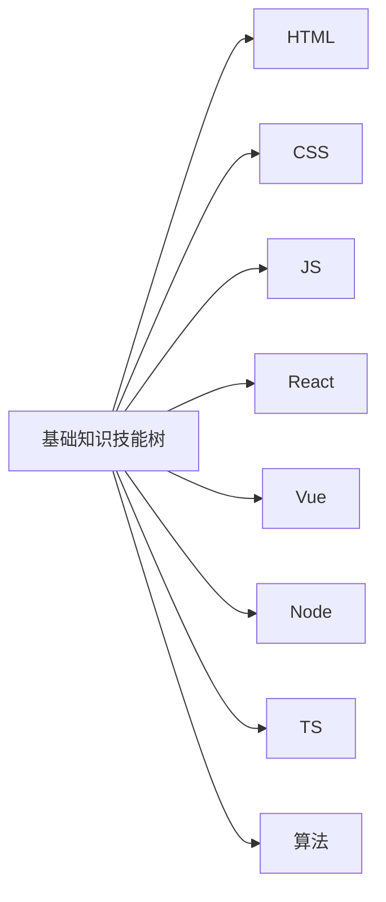
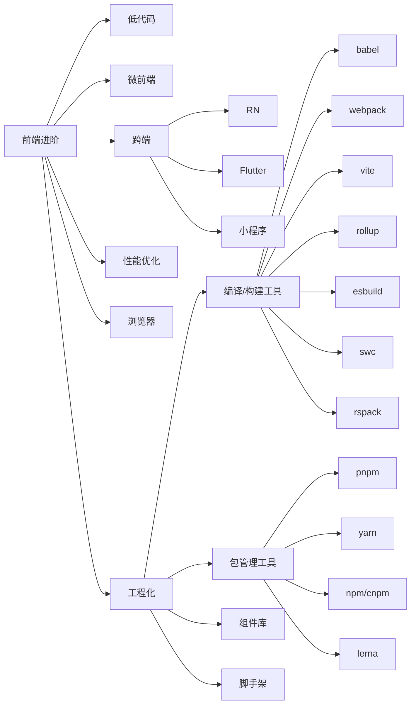
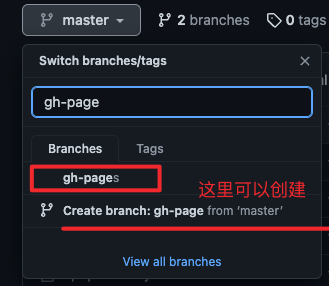

## 目标

- 1.利用 vitepress 搭建出博客的架子
- 2.对文章内容进行分栏分类
  - 基础知识技能树
    - HTML
    - CSS
    - JS
    - React
    - Vue
    - Node
    - TS
    - 算法
  - 前端进阶
    - 低代码
    - 微前端
    - 跨端
      - RN
      - Flutter
      - 小程序
    - 性能优化
    - 浏览器
    - 工程化
      - 编译/构建工具
        - babel
        - webpack
        - vite
        - rollup
        - esbuild
        - rspack
        - swc
      - 包管理工具
        - pnpm
        - yarn
        - npm/cnpm
        - lerna
      - 组件库
      - 脚手架

## 过程




### 1.第一步 利用 vitepress 搭建出博客的架子

#### 1.1 创建和启动

```bash
mkdir laughsun-blog && cd laughsun-blog
pnpm init
pnpm add -D vitepress vue
mkdir docs && echo '# Hello VitePress' > docs/index.md # docs/index.md默认就是首页
```

```json
{
  // ...
	"scripts": {
    "docs:dev": "vitepress dev docs --open",
    "docs:build": "vitepress build docs",
    "docs:preview": "vitepress preview docs"
  }
  // ...
}
```

```bash
pnpm docs:dev
http://localhost:5173/
```

#### 1.2 配置主页和菜单内容

```bash
touch docs/.vitepress/config.ts
```

##### 1.2.1 修改首页 docs/index.md

```md
---
layout: home

title: 网页的title
titleTemplate: 网页的title右边的文字

hero:
  name: 显示的大名字
  text: 显示的大内容
  tagline: 大内容下的一行字
  image:
    src: 这里塞一张右边的图片，可以放在public里面 /imgxxx
    alt: 
  actions:
    - theme: brand
      text: 开始学习
      link: /主页
    - theme: alt
      text: 我的GitHub
      link: 替换成github地址

features:
  - icon: 🔑
    title: xxx
    details: xxx.
  - icon: 💡
    title: xxx
    details: xxx.
  - icon: 📦
    title: xxx
    details: xxx.
  - icon: 🚀
    title: xxx
    details: xxx.
---
```

##### 1.2.2 基础配置

```tsx
import { defineConfig } from 'vitepress';

export default defineConfig({
    lang: 'zh-CN',
    title: 'LaughSun的前端之旅',
    description: '学习前端',
    themeConfig: {
        siteTitle: 'Hello World',
        logo: 'https://avatars.githubusercontent.com/u/30840073?v=4'
    }
})
```

##### 1.2.3 多菜单栏+多侧边栏

> 预期: 点击右边的菜单，左边会出现对应的文章侧边栏

```ts
export default defineConfig({
    themeConfig: {
        nav: [
            {
                text: '菜单1',
                link: '/menu1/a.md',
                activeMatch: '/menu1/',
            },
            {
                text: '菜单2',
                link: '/menu2/a.md',
                activeMatch: '/menu2/',
            },
            {
                text: '菜单3',
                link: '/menu3/a.md',
                activeMatch: '/menu3/',
            }
        ],
        sidebar: {
            '/menu1/': [
                {
                    text: '侧边章节1',
                    items: [
                        { text: 'a', link: '/menu1/a.md' },
                        { text: 'b', link: '/menu1/b.md' }
                    ],
                    collapsed: false
                }
            ],
            '/menu2/': [
                {
                    text: '侧边章节1',
                    items: [
                        { text: 'a', link: '/menu2/a.md' },
                        { text: 'b', link: '/menu2/b.md' }
                    ],
                    collapsed: false
                }
            ],
            '/menu3/': [
                {
                    text: '侧边章节1',
                    items: [
                        { text: 'a', link: '/menu3/a.md' },
                        { text: 'b', link: '/menu3/b.md' }
                    ],
                    collapsed: false
                }
            ],
        }
    }
})
```

#### 1.3 部署文档到 github pages

##### 1.3.1 github 上创建仓库

这里创建一个仓库叫做 fe-blogs

##### 1.3.2 将仓库名字添加到配置中

```ts
// docs/.vitepress/config.ts
//...
export default defineConfig({
    base: '/fe-blogs/',
    //...
})
```

##### 1.3.3 Github 仓库中创建分支 gh-pages



##### 1.3.4 配置 Github 的部署脚本

1.Setting --> Pages ---> Build and deployment 选择 GitHhub Actions 2.创建 Github Actions 部署脚本

- 创建 `.github/workflows/deploy.yml`

3.拷贝官方 vitepress 的 yml 文件
[vitepress 的部署脚本](https://vitepress.dev/guide/deploy)

```yaml
name: Deploy
on:
  workflow_dispatch: {}
  push:
    branches:
      - main
jobs:
  deploy:
    runs-on: ubuntu-latest
    permissions:
      pages: write
      id-token: write
    environment:
      name: github-pages
      url: ${{ steps.deployment.outputs.page_url }}
    steps:
      - uses: actions/checkout@v3
        with:
          fetch-depth: 0
      - uses: actions/setup-node@v3
        with:
          node-version: 16
          cache: npm
      - run: npm ci
      - name: Build
        run: npm run docs:build
      - uses: actions/configure-pages@v2
      - uses: actions/upload-pages-artifact@v1
        with:
          path: docs/.vitepress/dist
      - name: Deploy
        id: deployment
        uses: actions/deploy-pages@v1
```

4.想使用 pnpm 来部署脚本

> 注意:<br/> 1.保证 Node 版本和环境中有 pnpm<br/> 2.保证项目中有 lock 文件 pnpm-lock.yaml<br/> 3.保证按照 lock 文件来安装依赖 pnpm install --frozen-lockfile<br/>

```yaml
# 保证Node版本和环境中有pnpm
- uses: actions/checkout@v3
  with:
    fetch-depth: 0
- name: Install pnpm
  uses: pnpm/action-setup@v2
  with:
    version: 7.17.0
- uses: actions/setup-node@v3
  with:
    node-version: 16
    cache: pnpm
```

```yaml
# 保证按照lock文件来安装依赖
 - name: Install dependencies
  run: pnpm install --frozen-lockfile
```

5.完整的 yml 文件

```yaml
name: Deploy
on:
  workflow_dispatch: {}
  push:
    branches:
      - master
jobs:
  deploy:
    runs-on: ubuntu-latest
    permissions:
      pages: write
      id-token: write
    environment:
      name: github-pages
      url: ${{ steps.deployment.outputs.page_url }}
    steps:
      - uses: actions/checkout@v3
        with:
          fetch-depth: 0
      - name: Install pnpm
        uses: pnpm/action-setup@v2
        with:
          version: 7.17.0
      - uses: actions/setup-node@v3
        with:
          node-version: 16
          cache: pnpm
      - name: Install dependencies
        run: pnpm install --frozen-lockfile
      - name: Build
        run: pnpm run docs:build
      - uses: actions/configure-pages@v2
      - uses: actions/upload-pages-artifact@v1
        with:
          path: docs/.vitepress/dist
      - name: Deploy
        id: deployment
        uses: actions/deploy-pages@v1
```

6.Github Action 部署通过生成链接<br/>
https://laughsun0513.github.io/fe-blogs/
