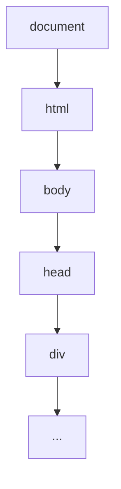

## 目录
- [1.行内元素和块元素?元素转换](#行内元素和块元素)
- [2.link和@import区别](#link和@import区别)
- [3.title和h1的区别,b和strong的区别,i和em的区别](#title和h1的区别,b和strong的区别,i和em的区别)
- [4.img的title和alt有什么区别](#img的title和alt有什么区别)
- [5.png/jpg/gif/webp](#png/jpg/gif/webp)
- [6.h5语义化标签](#h5语义化标签)
- [7.IOS解决键盘首字母大写](#IOS解决键盘首字母大写)
- [8.对DOM树的理解](#对DOM树的理解)

#### 行内元素和块元素

  > 行内元素 span img input
  > 块元素 div header footer p section  h1
  > 元素转换: display:inline/inline-block/block

#### link和@import区别

  > 区别1： link:  兼容性更好
  >
  > 区别2： 先加载link 后加载@import

#### title和h1的区别,b和strong的区别,i和em的区别

  > 1. 定义不同 title网站标题/h1内容标题
  >
  > 2. title更加有利于网站的SEO

  > 1. b实体标签，文字加粗 / strong逻辑标签，加强字符语气
  >
  > 2. b只有加粗的样式没有实际含义 / strong表示标签内字符比较重要，用来强调

  > 1. i实体标签，文字倾斜 / em逻辑标签，强调文字内容
  > 2. i只是倾斜样式没有实际含义 / em 表示标签内字符重要，用来强调

#### img的title和alt有什么区别

  > title移入图片鼠标显示的值
  >
  > alt 图片无法加载的时候显示的值，SEO时候可以更好的被爬虫抓取

#### png/jpg/gif/webp

  > png:  无损压缩，尺寸体积要比jpg、jpeg大，适合做小图标
  >
  > jpg： 采用压缩算法，有一点失真，比png小，适合中大图片
  >
  > gif： 一般做动图
  >
  > webp： 支持有损/无损压缩，相同质量的图片，webp体积更小，兼容性不好

#### h5语义化标签
> IE8不兼容，使用html5shiv.js处理
```html
<header></header>
<footer></footer>
<nav></nav>
<aside></aside>
<section></section>
```

#### IOS解决键盘首字母大写
```js
<input type='text' autocapitalize='off'>
```

#### 对DOM树的理解
浏览器会将HTML的标签通过htmlparser解析成DOM树



