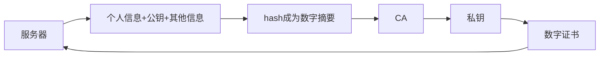
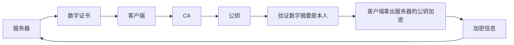
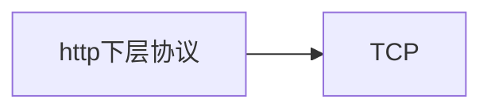
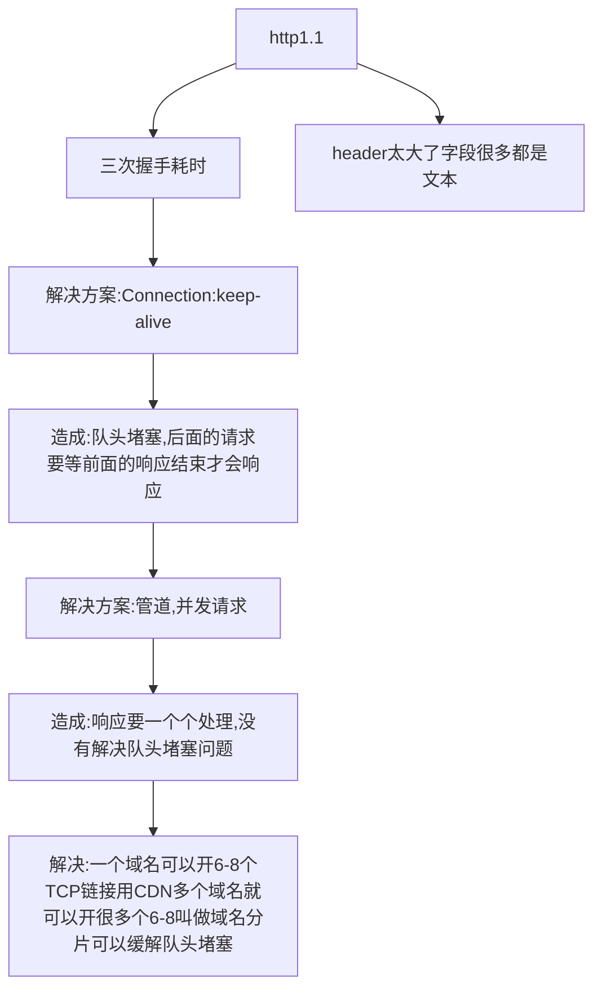
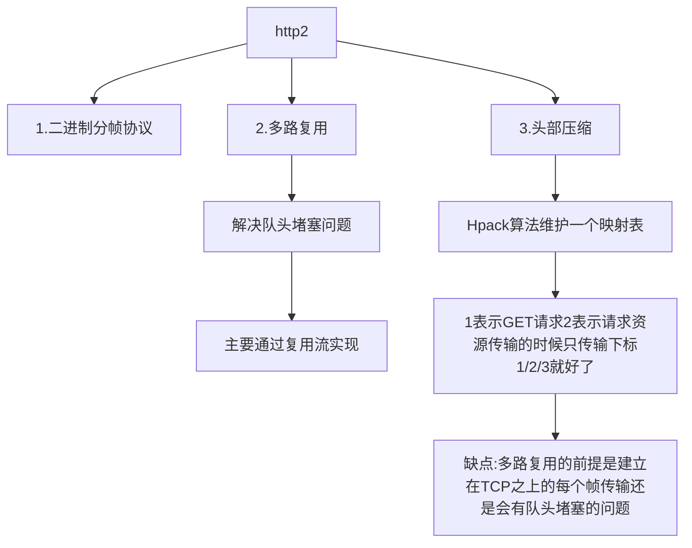
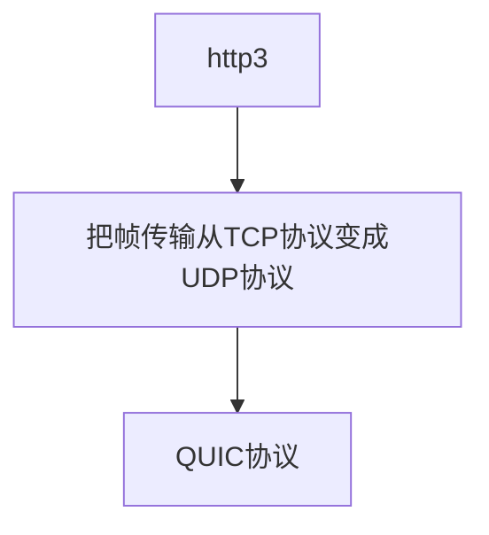

## 网络相关

- [1.https 加密的过程](#https加密的过程)
- [2.http1.1/http2/http3](#http1-1-http2-http3)

### https 加密的过程
- [参考文章](https://juejin.cn/post/6844904038509576199)

加密方式:
| 1.对称加密 | 两个人(客户端和服务端)都拥有一样的 key 用来加密和解密，类似都有一本新华字典，然后传输的时候是用 key 加密的字符串，然后通过 key 来接收到解密 |
| --- | --- |
| 2.非对称加密 | 服务端准备两把钥匙(公钥和私钥)客户端要发消息的时候，请求下告诉服务端要传消息了，把公钥拿过来，然后加密后传输给服务端服务端拿到加密的内容用私钥解密出内容 |
| 3.中间人攻击 | 对称加密和非对称加密都存在一定的问题，因为传输的时候需要 key 或者公钥，被中间人劫持了之后，就会导致中间人可以假装对方篡改消息 |
| 4.数字证书(用来证明这个公钥是服务端发过来的) | 怎么证明呢? 需要公证处 CA,CA有两把钥匙，公钥和私钥服务端把自己的 个人信息+公钥+其他信息 生成一个 hash 变成数字摘要 给公证处 CA,CA 拿到后，通过自己的私钥加密后生成数字证书客户端要请求的时候，服务端把数字证书给客户端客户端拿到后先让公证处 CA 拿自己的公钥解密看看是不是公证处加密的，里面的数字摘要是不是服务端这个人如果是，那就正常用服务端的公钥加密信息传输即可如果不是，那就说明是有问题的 |

### http1.1-http2-http3
- [参考文章](https://blog.csdn.net/wolfGuiDao/article/details/108729560)

