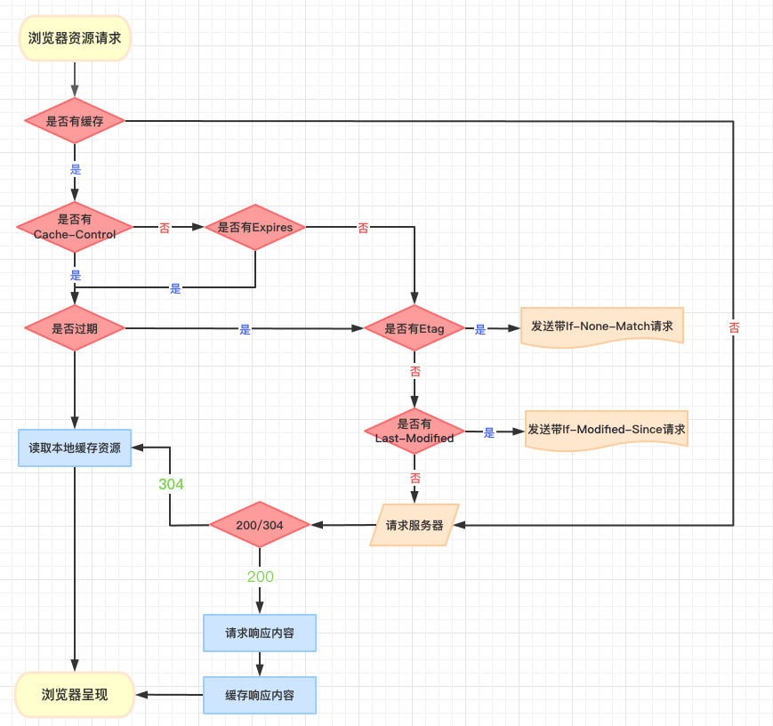
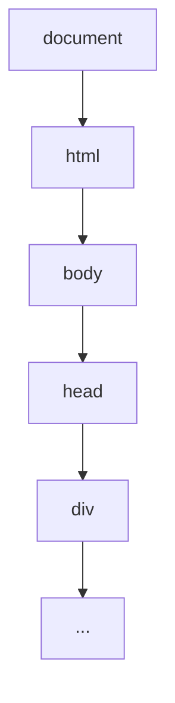

## 浏览器相关

- [1.浏览器渲染流程](#浏览器渲染流程)
- [2.重排/重绘/合成](#重排-重绘-合成)
- [3.浏览器缓存](#浏览器缓存)
- [4.对DOM树的理解](#对dom树的理解)

### 浏览器渲染流程

1.构建 DOM 树
  - 就是把标签变成一棵树

2.样式计算 Style

  - 2.1 把 CSS 转换为浏览器能够理解的结构
    - 就是把 link css/style css/ style='xx' 这三种全部变成 styleSheets
  - 2.2 转换样式值
    - 把 blue 变成 rgb 值
  - 2.3 计算 DOM 树中的节点的具体样式

    - css 继承，继承父级节点的样式 如 font-size
    - css 层叠

3.布局阶段 Layout

  - 3.1 创建布局树 LayoutTree
    - 忽略隐藏的元素 找到所有可见元素
    - 忽略 head 下所有内容
  - 3.2 布局计算

    - 找到布局树节点元素的坐标位置

4.分层 Layer

  - 绘制图层树 LayerTree
  - 什么情况会单独抽出一层？
  - 有层叠上下文的属性 fixed/z-index/filter/opacity
  - 需要裁剪的地方 比如文字超出盒子/ 出现滚动条

5.绘制图层 Paint

  - 就是把图层绘制变成一个个指令

    - 比如 画方形红色坐标 xy / 画圆形蓝色坐标 x1y1 变成一个绘制顺序和绘制指令的列表映射

6.栅格化操作
  - 主线程(前面 5 步)一次性 commit 给合成线程
  - 会把整张长页面变成一个个图块
  - 图块需要变成位图，叫做栅格化
  - 渲染进程会维护一个栅格化线程池，里面一个个栅格化线程

  - 一个栅格化过程会去 GPU 进程中生成位图然后保存在 GPU 内存中

7.合成和显示
  - 光栅化结束，合成线程生成一个绘制图块的命令 
  - DrawQuad 给浏览器进程
  - 浏览器进程里的 viz 组件接收命令，然后将页面内容渲染出来

### 重排-重绘-合成

- 重排: 比如改变元素的高度， 直接从第二步 style 开始往后都走一遍
- 重绘: 比如改变元素的颜色，没有修改元素的坐标，直接跳过 3 和 4
- 合成: 使用 transform 来实现动画，直接跳过 2，3，4，直接执行 commit 栅格化操作

### 浏览器缓存

强缓存

- Expires 和 Cache-Control

协商缓存

- etag/if-None-Match
- Last-Modified/If-Modified-Since

`Cache-Control`的属性:
| no-cache | 禁止强缓存，每次都要协商, 资源没变返回 304 用缓存, 变了返回 200 |
| --- | --- |
| max-age=秒 | |
| immutable | 不用协商资源不变 |
| private | 资源在浏览器缓存，不想在代理服务器 CDN 上缓存 |
| public | 资源在浏览器和代理服务器 CDN 上都能缓存 |
| s-maxage | 代理服务器 CDN 上的时间 s-maxage:3153600 CDN 上缓存 1 年 |
| max-stale=600 | 过期 10 分钟还可以用 超过就用不了了 |
| stale-while-revalidate=600 | 浏览器协商没结束，先用缓存 |
| stale-if-error | 协商失败用缓存 |
| must-revalidate | 缓存失效，必须等协商结束，中间不准用过期的缓存 |
| no-store | 不缓存，所有资源的请求必须和首次请求一样，从服务器获取资源 |

- http1.0
  | Pragma: no-cache| |
  | --- | --- |
  | Expires | 指定一个 GMT 的过期时间，当浏览器时间不准，就会有问题 |

- http1.1
  | etag/if-None-Match | 一个 hash 值, 文件内容变了没 |
  | --- | --- |
  | Last-Modified/If-Modified-Since | 最后文件的修改时间 |

Etag 的值是服务器计算出的一串 hash 值，如果计算过程较复杂，比较消耗性能
如果获取某些文件的最后修改时间比较容易，而文件的变更频率也不高，那无疑使用 Last-Modified 更合适

Etag 和 Last-Modified 同时存在时，服务器会优先判断 Etag，
如果 Etag 的值相同会继续判断 Last-Modified，最后才决定是返回 200 还是 304 状态

### 对dom树的理解
浏览器会将HTML的标签通过htmlparser解析成DOM树
